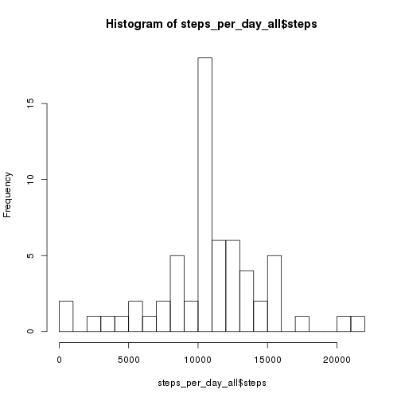

# Introduction
This is the first assignment project for the Reproducible Research course at [Coursera.org](https://www.coursera.org). The aim of this project is to use R-Markdown documents to analyze data from a personal activity monitoring device. The data stored into a .CSV file inside a .ZIP file and the request is to make a step by step guide to some analysis on it.

## Loading and preprocessing the data
First step, the data must be loaded. In order to do this we must check first that a .CSV
file, named activity.csv, is available in the current working directory, otherwise we assume that there is a .ZIP file named 'activity.zip' in the same directory.
After reading the data we ensure that it is cleaned and transformed as we need: in this case we convert the 'date' column to a Date object.


```r
library(data.table)
library(dplyr)

if( !file.exists('activity.csv') )
  unzip('activity.zip')
odata <- fread("activity.csv")
odata$date <- as.Date(odata$date)
data <- subset(odata, !is.na(odata$steps))
```


## What is mean total number of steps taken per day?
Second step consists into three subparts:
### Total number, histogram, mean and median of steps per day

```r
steps_per_day <- data %>% group_by(date) %>% summarise(steps=sum(steps))
hist(steps_per_day$steps, breaks=20)
```

 

```r
mean(steps_per_day$steps)
```

```
## [1] 10766.19
```

```r
median(steps_per_day$steps)
```

```
## [1] 10765
```

## What is the average daily activity pattern?

```r
spi <- data %>% group_by(interval) %>% summarise(avg=mean(steps))
plot(x=spi$interval, y=spi$avg, type='l', xlab='5 minute interval', ylab='steps', main='Avg steps taken')
```

 

```r
spi[max(spi$avg),]
```

```
## Source: local data table [1 x 2]
## 
##   interval      avg
## 1     1705 56.30189
```

## Imputing missing values
1. Number of NA values
2. Filling NA values (data_na) with the mean value of steps
3. New dataset with missing data (all_data)
4. Histogram, mean and median of new dataset

```r
mdata <- merge(odata, spi, by="interval")
all_data <- mdata %>% mutate(steps=ifelse(is.na(steps), avg, steps))

steps_per_day_all <- all_data %>% group_by(date) %>% summarise(steps=sum(steps))
hist(steps_per_day_all$steps, breaks=20)
```

 

```r
mean(steps_per_day_all$steps)
```

```
## [1] 10766.19
```

```r
median(steps_per_day_all$steps)
```

```
## [1] 10766.19
```

By replacing the missing NAs with the mean value of their corresponding interval we achieved a normalization of the media, i.e. the median is now closer (equal, with this precision) to the mean.

Similarly, if we replace all missing values with the mean of all steps, we will move toward the centre of the distribution, i.e. the histogram will be more pronounced on th central bin (the one containing the mean value)

## Are there differences in activity patterns between weekdays and weekends?
1. Create a new factor column representing the fact that a day is in thhe weekend or not
2. Panel plots average number of steps (y) per interval (x), categorized by week day type

```r
library(ggplot2)
all_data$daytype <- as.factor(ifelse(weekdays(all_data$date) %in% c("Saturday", "Sunday"), "weekend", "weekday"))
pdata <- all_data %>% group_by(daytype, interval) %>% summarise(avg=mean(steps))
qplot(data=pdata, interval, avg, geom='line', facets=daytype ~ .)
```

 
